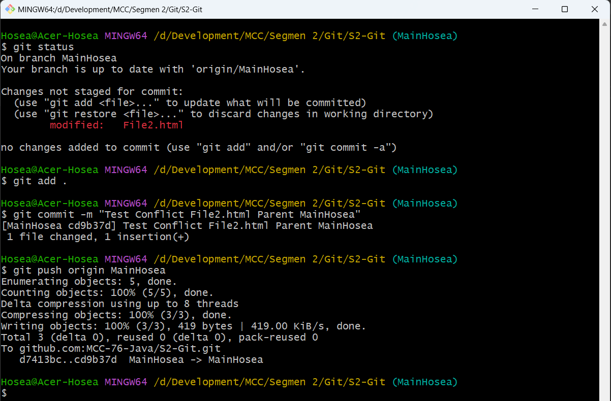
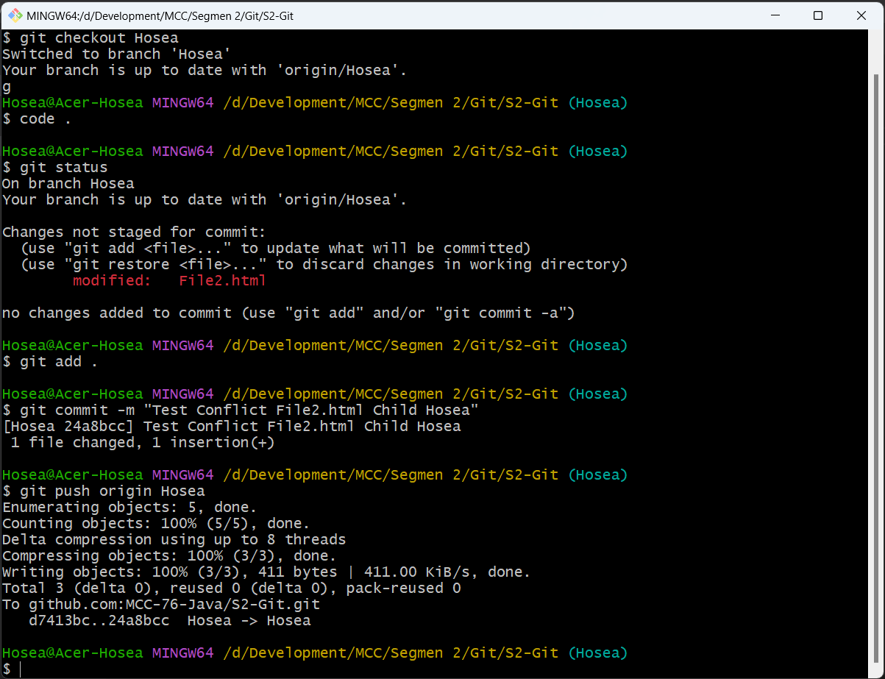
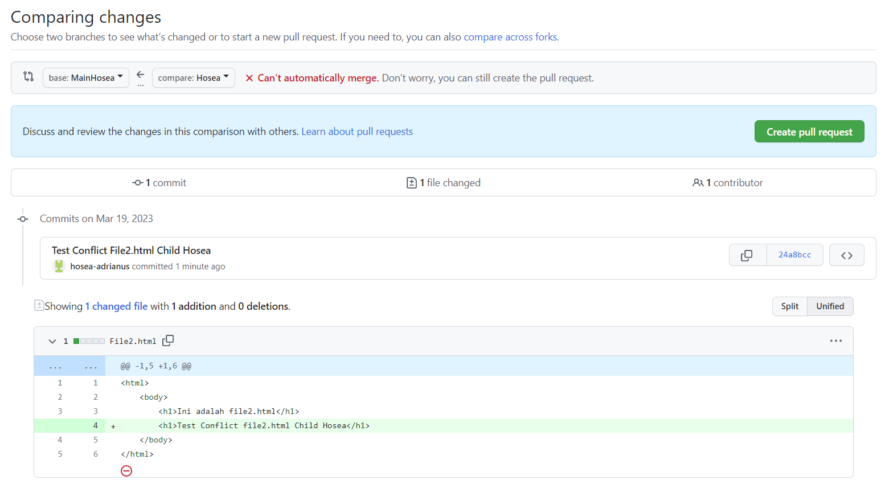

# Learning Git

## Main Task

- Git Init

- Git Add dan Commit: Parent MainHosea

- Git Branch dan Checkout

- Git Add dan Commit: Child Hosea

- Fast Forward Merge 

- Git Push

- Fast Forward Merge 2

- Git Clone

- Git Checkout Branch Remote

- Git TestConflict: Parent MainHosea

- Git TestConflict: Child Hosea

- Create Pull Request

- Pull Request - Merge Conflict

- Three Way Merge - Warning Conflict

- Three Way Merge - Fixing Conflict

- Three Way Merge - Solved Conflict

- Pull Request - Solved Conflict

