# **[S2-Tugas1-Git] - Hosea Adrianus**

- Git Init
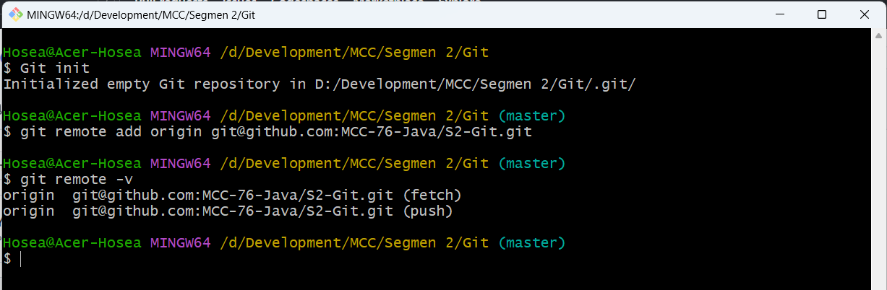

- Git Add dan Commit

- Git Branch dan Checkout
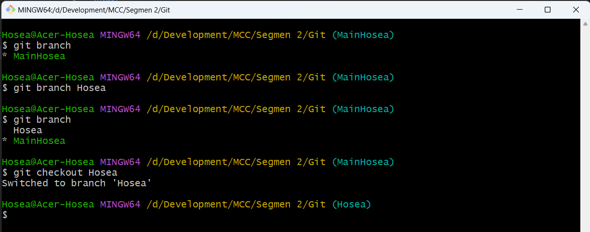

- Fast Forward Merge 
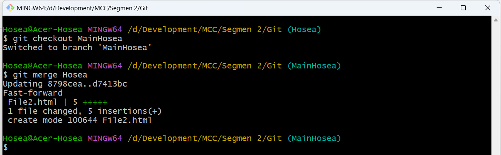

- Git Push
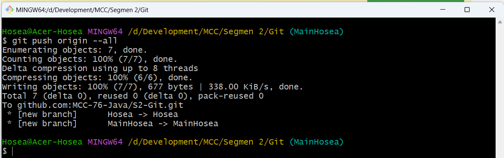

- Fast Forward Merge - Graph
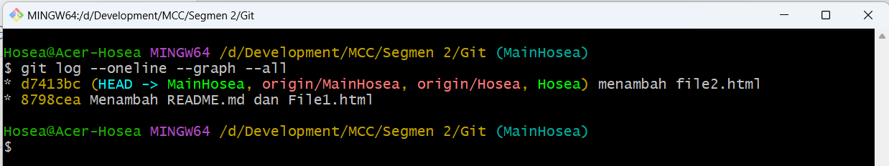

- Git Clone
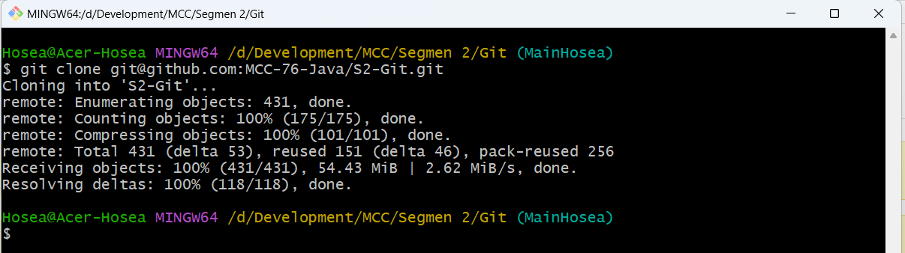

- Git Checkout Branch Remote
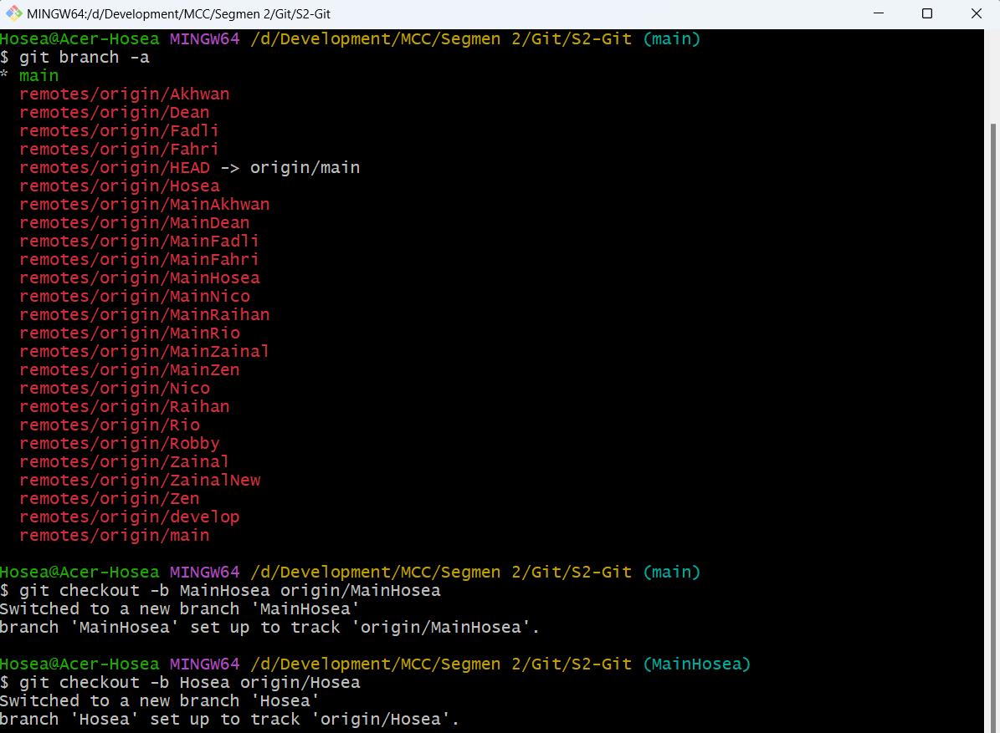

- Pull Request - Merge Conflict
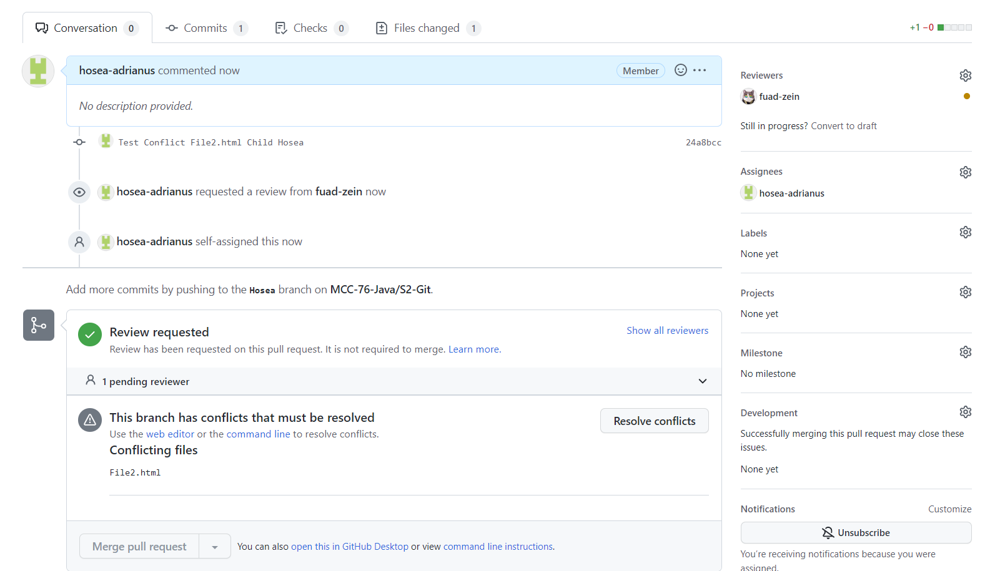

- Three Way Merge - Warning Conflict
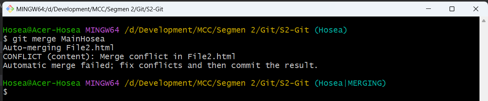

- Three Way Merge - Fixing Conflict
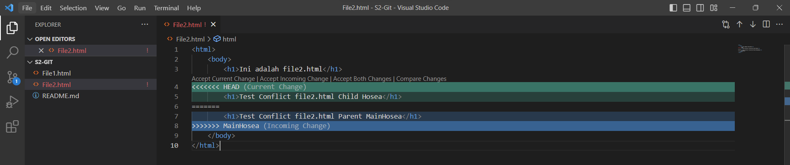

- Three Way Merge - Solved Conflict
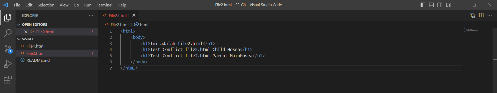

- Pull Request - Solved Conflict
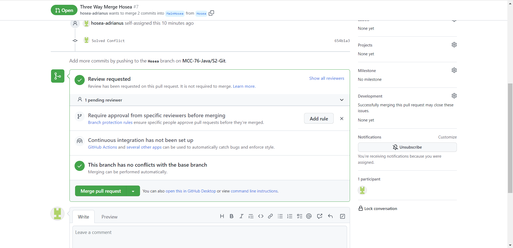

- Three Way Merge - Graph

