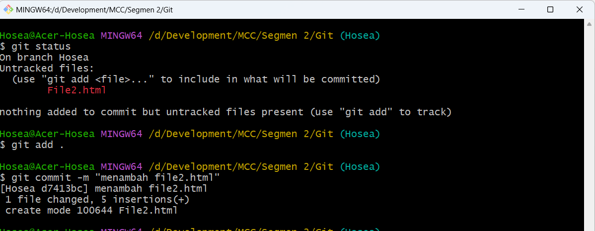

# Learning Git

## Main Task

- Git Init

- Git Add dan Commit: Parent MainHosea

- Git Branch dan Checkout

- Git Add dan Commit: Child Hosea

- Fast Forward Merge 2

- Git Push

- Fast Forward Merge 2

- Git Clone

- Git Checkout Branch Remote

