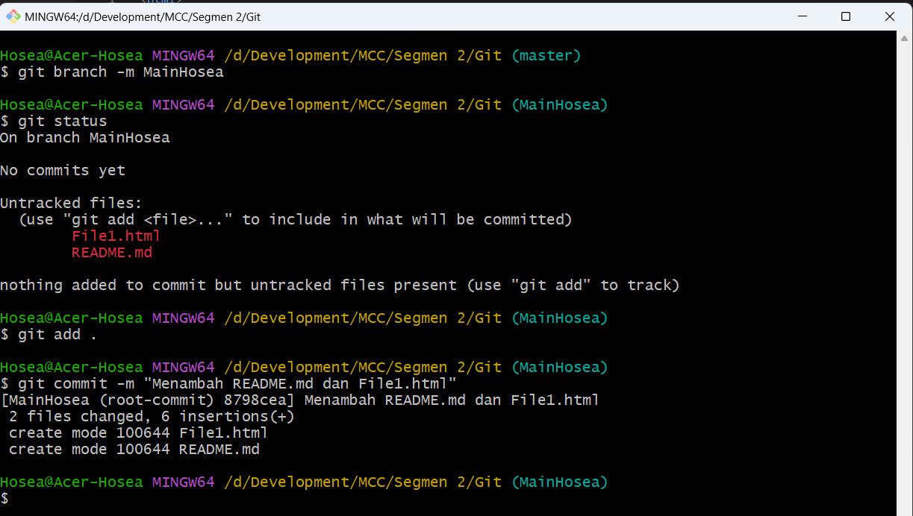

# **[S2-Tugas1-Git] - Hosea Adrianus**

- Git Init

- Git Add dan Commit

- Git Branch dan Checkout

- Fast Forward Merge 

- Git Push

- Fast Forward Merge - Graph

- Git Clone

- Git Checkout Branch Remote

- Pull Request - Merge Conflict

- Three Way Merge - Warning Conflict

- Three Way Merge - Fixing Conflict

- Three Way Merge - Solved Conflict

- Pull Request - Solved Conflict

- Three Way Merge - Graph

